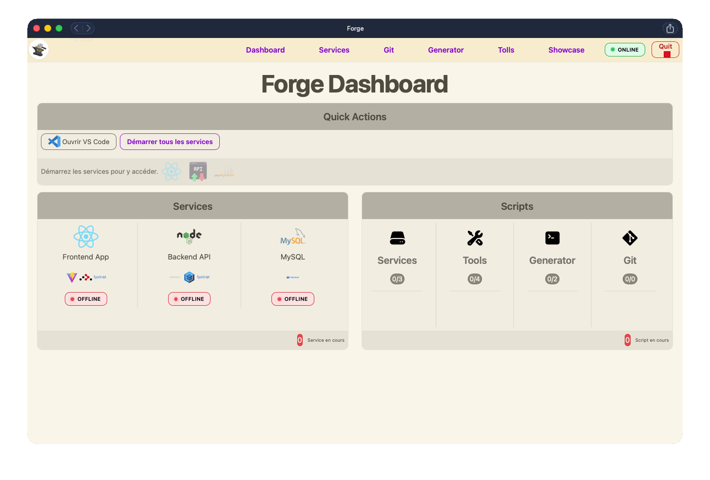

<p align="center">
  
</p>

<h1 align="center">Forge Stack</h1>

<p align="center">
  ⚡ Monorepo • CLI • Code Generator • Git UI
</p>

<p align="center">
  
  
  
  
</p>

<p align="center">
  🚀 Build, manage and scale your fullstack apps — all in one place
</p>

---

## 📌 À propos de ce projet

Forge Stack est un **projet personnel d'apprentissage** développé par [Sébastien Drillaud](https://github.com/Seb-Prod).

L'objectif est de construire un environnement de développement fullstack complet, avec un outillage maison (Forge) pour gérer l'ensemble du workflow sans ligne de commande.

> 🧪 **Forge est en cours de développement.** Une fois terminé, ce monorepo servira de base pour développer de vraies applications. La section ci-dessous sera mise à jour en conséquence.

---

## 🚀 Projet en cours avec Forge

> ⏳ Cette section sera complétée lorsque Forge sera opérationnel et qu'un premier projet réel sera lancé dessus.

> 🧪 Ce monorepo est actuellement utilisé pour développer : **[Nom du projet]**

<p align="center">
  
  
</p>

### 🎯 Objectif

> [Décris rapidement le projet]

### 📖 Documentation complète

| Partie       | Documentation                          |
| ------------ | -------------------------------------- |
| **Frontend** | [📖 README](./apps/frontend/README.md) |
| **Backend**  | [📖 README](./apps/backend/README.md)  |

👉 Ce projet sert de **cas réel d’utilisation de Forge Stack**.

---

## ✨ Pourquoi Forge ?

Forge Stack est un environnement de développement **DX-first** conçu pour simplifier radicalement le développement fullstack.

| Problème classique                | Solution Forge                                     |
| --------------------------------- | -------------------------------------------------- |
| Jongler entre plusieurs terminaux | Un seul outil centralisé                           |
| Générer du code à la main         | Génération automatique de composants, pages, hooks |
| Git en ligne de commande          | Interface Git intégrée (commit, branch, push…)     |
| Logs éparpillés                   | Visualisation temps réel de tous les services      |
| Config `.env` manuelle            | Éditeur d'environnement intégré                    |

👉 Concentrez-vous sur le code, Forge s’occupe du reste.

---

### Structure du monorepo

Monorepo **pnpm workspace** centralisant l'ensemble de l'écosystème :

```
monorepo-xxx/
├── apps/
│   ├── frontend/          # React 19 + TypeScript + Vite
│   └── backend/           # Node.js + Express + Sequelize
├── packages/
│   ├── ui/                # @workspace/ui - Composants React
│   ├── functions/         # @workspace/functions - Utils TS
│   └── styles/            # @workspace/styles - CSS globaux
├── tools/
│   └── forge/             # Forge - Gestionnaire monorepo
├── docs/                  # Documentation
└── images/                # Assets README
```

**Plateformes** : 💻 Desktop • 📱 Mobile • 📲 Tablet • 🚀 PWA

---

## 📦 Applications et services
 
| App / Service  | Stack                  | Port | Documentation                               |
| -------------- | ---------------------- | ---- | ------------------------------------------- |
| **Frontend**   | React 19 + Vite + TS   | 5173 | [📖 README](./apps/frontend/README.md)      |
| **Backend**    | Node.js + Express + TS | 8000 | [📖 README](./apps/backend/README.md)       |
| **MySQL**      | Docker                 | 3306 | —                                           |
| **phpMyAdmin** | Docker                 | 8081 | http://localhost:8081                       |
| **Forge**      | React + Node.js        | Auto | [📖 README](./tools/forge/README.md)        |
 
### Packages partagés
 
```ts
import { Button, Card } from "@workspace/ui";
import { formatDate, validateEmail } from "@workspace/functions";
import "@workspace/styles/global.css";
```
 
Docs packages : [📖 UI](./packages/ui/README.md) • [📖 Functions](./packages/functions/README.md) • [📖 Styles](./packages/styles/README.md)
 
---

## 🚀 Démarrage rapide

### Prérequis

- Node.js ≥ 20
- pnpm ≥ 9
- Docker (MySQL + phpMyAdmin)

### Installation

```bash
git clone https://github.com/votre-org/monorepo-xxx.git
cd monorepo-xxx
pnpm install
```

### Lancement avec Forge (recommandé)

```bash
pnpm forge  # Lance l'interface Forge
```

**Forge** est le **centre de contrôle** du monorepo. Il permet de :

✅ **Gérer les serveurs** : Démarrer/arrêter Frontend, Backend, Docker  
✅ **Créer des composants** : Générer automatiquement components, pages, hooks  
✅ **Gérer Git** : Commits, branches, pull/push simplifiés  
✅ **Visualiser les logs** : Tous les services en temps réel  
✅ **Configurer l'environnement** : Édition des `.env`  
✅ **Exécuter les scripts** : Build, tests, lint, etc.

👉 **Tout se fait via Forge** — plus besoin de ligne de commande !

### Lancement manuel (optionnel)

Si vous préférez la ligne de commande :
 
```bash
pnpm dev:frontend     # Frontend seul
pnpm dev:backend      # Backend seul
pnpm build            # Build tout
pnpm lint             # Linter
docker-compose up -d  # MySQL + phpMyAdmin
```

---

## 🎬 Démo

<p align="center">
  
</p>

---
 
## 🏗️ Stack technique
 
| Technologie | Version    |
| ----------- | ---------- |
| Node.js     | 20         |
| pnpm        | 9          |
| TypeScript  | 5          |
| React       | 19         |
| Vite        | 7          |
| Express     | 5          |
| Sequelize   | 6          |
| MySQL       | 8 (Docker) |
 
---

## 🤝 Conventions de contribution
 
### 🌿 Gestion des branches
 
**Format :** `{type}/{scope}-{description}`
 
| Type        | Usage                                             |
| :---------- | :------------------------------------------------ |
| `feature/`  | Ajout d'une nouvelle fonctionnalité               |
| `fix/`      | Correction d'un bug                               |
| `docs/`     | Modification de la documentation                  |
| `refactor/` | Amélioration du code sans changement fonctionnel  |
 
**Exemples :**
- `feature/frontend-login-page`
- `feature/backend-auth-middleware`
- `fix/ui-button-spacing`
 
---
 
### 💾 Convention de commit
 
Nous suivons la spécification [Conventional Commits](https://www.conventionalcommits.org/).
 
**Format :** `type(scope): description`
 
#### Scopes autorisés
 
- **Apps :** `frontend`, `backend`
- **Packages :** `ui`, `hooks`, `styles`, `functions`
- **Tools :** `forge-be`, `forge-fe`, `scripts`
- **Global :** `repo`
 
#### Exemple — feature touchant plusieurs parties
 
```bash
git commit -m "feat(backend): create get-profile endpoint"
git commit -m "feat(ui): add UserAvatar component"
git commit -m "feat(frontend): implement profile view logic"
```
 
> 💡 Si une fonctionnalité touche plusieurs zones, **séparez vos commits par scope** plutôt que de faire un commit global. Cela facilite la relecture et les éventuels rollbacks.
 
---
 
## 📄 Licence
 
<p align="center">
  
</p>
 
<p align="center">
  <strong>© 2026 Sébastien Drillaud (Seb-Prod)</strong><br/>
  Tous droits réservés.
</p>
 
<p align="center">
  <a href="https://github.com/Seb-Prod">
    
  </a>
  <a href="https://www.linkedin.com/in/sébastien-drillaud-b68b3318a/">
    
  </a>
</p>
 