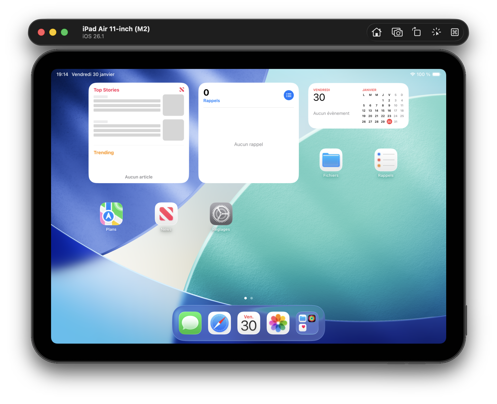
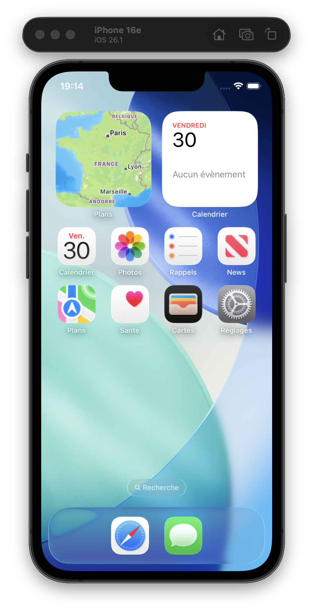

#  Frontend - Application xxx

  

Application frontend moderne construite avec React 19, TypeScript, Vite.

---

## 📸 Aperçu de l'application

### Version Desktop


### Version Mobile


---

## 📱 💻 Plateformes supportées

L’application est conçue pour fonctionner sur plusieurs formats :

- 💻 **Desktop** (navigateurs modernes)  
- 📱 **Mobile** (responsive design)  
- 📲 **Tablet**  
- 🚀 **PWA mobile** (installable sur iOS et Android)

### 🌐 Web responsive
L’interface s’adapte automatiquement à toutes les tailles d’écran.

### 📲 Progressive Web App (PWA)
- Ajout à l’écran d’accueil  
- Mode plein écran  
- Fonctionnement hors ligne partiel  
- Expérience fluide sur mobile

---


## ⚠️ Important — Monorepo

Ce projet fait partie d’un **monorepo pnpm**.

👉 Toutes les commandes doivent être exécutées **depuis la racine du dépôt**, et non depuis `apps/frontend`.

⚠️ Les scripts de développement sont centralisés dans l'application **Forge**, qui permet de :  


- centraliser le lancement des services  
- gérer les scripts globaux  
- simplifier le workflow développeur  

Le workspace gère également :  
- les dépendances partagées  
- les packages internes (`@workspace/ui`, `@workspace/functions`, `@workspace/styles`)  
- les scripts globaux  

---

## 📋 Vue d'ensemble

Interface utilisateur principale du projet. Application SPA (Single Page Application) offrant une expérience utilisateur fluide et réactive.

**Technologies** :
- ⚛️ React 19 (avec Hooks)
- 📘 TypeScript
- ⚡ Vite (build ultra-rapide)
- 🧭 React Router v6
- 🎨 CSS Modules
- 📦 Packages workspace (`@workspace/ui`, `@workspace/functions`, `@workspace/styles`)

---

## 🚀 Démarrage rapide

Depuis la racine du monorepo :

```bash
pnpm install   # Installer les dépendances
pnpm dev       # Lancer le serveur de développement
```

L’application sera disponible à l’adresse :
👉 http://localhost:5173


---

## 📁 Structure du projet

```
apps/frontend/
├── public/
│   ├── favicon.ico
│   └── images/
│
├── src/
│   ├── assets/
│   │   ├── fonts/
│   │   ├── images/
│   │   └── icons/
│   │
│   ├── components/
│   │   ├── .../
│   │   └── ...
│   │
│   ├── pages/ 
│   │   ├── .../
│   │   │   ├── ...
│   │   │   └── ...
│   │   └── .../
│   │
│   ├── features/
│   │   ├── .../
│   │   │   ├── components/
│   │   │   ├── hooks/
│   │   │   └── ...
│   │   └── .../
│   │
│   ├── layouts/
│   │   ├── ...
│   │   └── ...
│   │
│   ├── services/
│   │   ├── ...
│   │   └── ...
│   │
│   ├── hooks/
│   │   ├── ...
│   │   └── ...
│   │
│   ├── utils/ 
│   │   ├── ...
│   │   └── ...
│   │
│   ├── types/
│   │   ├── ...
│   │   └── ...
│   │
│   ├── router/
│   │   └── ...
│   │
│   ├── App.css
│   ├── App.tsx
│   ├── Index.css
│   └── main.tsx
│
├── .gitignore
├── index.html
├── package.json
├── README.md             # Ce fichier
├── tsconfig.app.json
├── tsconfig.json
├── tsconfig.node.json
└── vite.config.ts
```

---

## 🧠 Architecture

Le frontend suit une architecture modulaire par features :

- `components/` → composants UI globaux
- `features/` → logique métier par domaine
- `services/` → appels API
- `hooks/` → hooks personnalisés
- `types/` → types globaux
---

## 🎯 Fonctionnalités principales

### Pages disponibles

| Route | Description | Authentification |
|-------|-------------|------------------|
| `...` | .... | .... |

### Fonctionnalités implémentées

- ...

---

## 🧭 Routing

### Configuration des routes

**src/router/routes.config.tsx** :
```tsx
import { UnderConstructionPage } from "@workspace/ui/pages";
import type { AppRoute } from "@workspace/ui/types";
export const APP_ROUTES: AppRoute[] = [
  {
    to: "/",
    label: "Accueil",
    showInWeb: true,
    showInPWA: true,
    element: <UnderConstructionPage/>,
    icon: ""
  },
  {
    to: "/services",
    label: "Services",
    showInWeb: true,
    showInPWA: true,
    element: <UnderConstructionPage/>,
    icon: "",
  },
];
```
---

## 🔗 Communication API

Les appels API sont centralisés dans `src/services/`.

- Utilisation de TanStack Query
- Gestion du cache automatique
- Gestion des erreurs globalisée
---

## 🌍 Variables d'environnement

### Fichier `.env`
Créer un fichier `.env` dans `apps/frontend` :

```env
VITE_API_URL=http://localhost:3000
```

---
## 📚 Ressources

### Documentation officielle
- [React](https://react.dev/)
- [TypeScript](https://www.typescriptlang.org/)
- [Vite](https://vitejs.dev/)
- [React Router](https://reactrouter.com/)

### Guides internes
- [Guide des composants UI](../../packages/ui/README.md)
- [Guide du styles](../../packages/styles/README.md)
- [Guide des fonctions](../../packages/functions/README.md)
- [Architecture du monorepo](../../docs/architecture.md)
- [Conventions de code](../../docs/coding-standards.md)
- [Documentation Backend / API](../../apps/backend/README.md)

---

## 🤝 Contribution

Pour contribuer au frontend :

1. Créer une branche `feature/frontend-*`
2. Suivre les conventions de nommage des composants
3. Mettre à jour cette documentation si nécessaire

---

## ✅ Checklist de qualité

Avant de commiter :

- [ ] Types TypeScript corrects
- [ ] Pas de `console.log` oubliés
- [ ] Variables d'env documentées
- [ ] Composants réutilisables extraits dans `@workspace/ui`
- [ ] Fonctions réutilisables extraits dans `@workspace/functions`

---

**Dernière mise à jour** : Janvier 2026  
**Mainteneur** : Seb-Prod