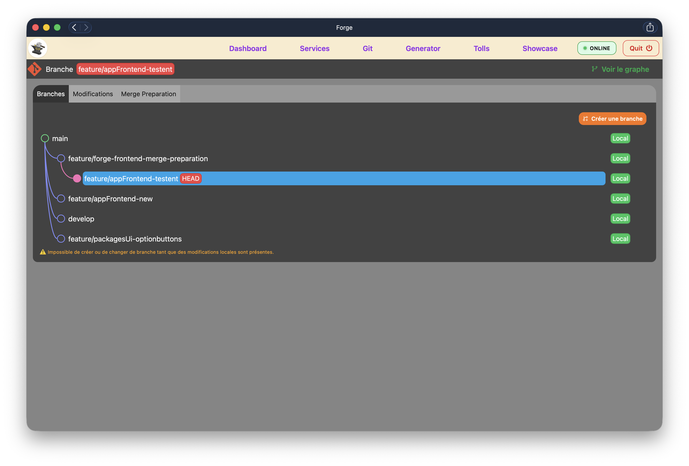
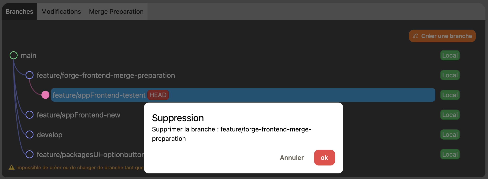

<p align="center">
  
</p>

<h1 align="center">Forge Documentation</h1>

<p align="center">
  
  
  

</p>
---

# GitBranchManager

GitBranchManager est un composant UI permettant de visualiser et manipuler les branches Git sous forme d’arbre interactif.

## Pourquoi ?

La gestion des branches Git devient rapidement complexe sur des projets avec de multiples branches actives.

GitBranchManager apporte :

- une visualisation claire des relations entre branches
- des actions sécurisées (checkout, suppression…)
- une meilleure compréhension du workflow Git

## Aperçu

### Vue globale

<p align="center">
  
</p>

### Actions sur une branche

<p align="center">
  
</p>

## Responsabilités

- Affichage de l'arbre des branches avec leurs chemins de connexion
- Mise en évidence de la branche active (HEAD)
- Indication de la présence locale / distante de chaque branche
- Actions contextuelles : checkout, renommer, supprimer une branche
- Création d'une nouvelle branche depuis la branche active
- Blocage des actions de changement de branche en cas de modifications locales

---

## Arborescence

```
GitBranchManager/
├── GitBranchManager.tsx         # Composant racine
├── GitBranchManager.module.css
└── components/
    ├── BranchPaths/             # Tracé SVG des connexions entre branches
    ├── BranchTree/              # Liste des BranchNode
    └── BranchNode/
        ├── BranchNode.tsx
        ├── BranchNode.module.css
        └── components/
            ├── BranchDot/       # Cercle coloré, positionné selon la profondeur
            ├── BranchName/      # Nom de la branche + badge HEAD
            ├── BranchSyncBadges/# Badges local / remote
            └── BranchActions/   # Logique des permissions + KebabMenu
```

---

## Composants

### `GitBranchManager`

Point d'entrée de la feature. Orchestre `BranchPaths`, `BranchTree` et le bouton de création.

Consomme :

- `useGitRepository()` — état des modifications locales
- `useGitModal()` — ouverture des modals

---

### `BranchNode`

Représente une branche dans l'arbre. Compose les quatre sous-composants ci-dessous.

| Prop       | Type      | Description                                     |
| ---------- | --------- | ----------------------------------------------- |
| `branch`   | `Branch`  | Données de la branche                           |
| `depth`    | `number`  | Profondeur dans l'arbre (indentation + couleur) |
| `isActive` | `boolean` | Indique si c'est la branche courante            |

---

### `BranchDot`

Nœud circulaire représentant une branche dans le graphe. La couleur et l'indentation sont dérivées de la profondeur via `getColor(depth)`.

| Prop         | Type      |
| ------------ | --------- |
| `depth`      | `number`  |
| `isActive`   | `boolean` |
| `branchName` | `string`  |

---

### `BranchName`

Affiche le nom d'une branche avec un badge `HEAD` si elle est active.

| Prop         | Type      |
| ------------ | --------- |
| `branchName` | `string`  |
| `isActive`   | `boolean` |

---

### `BranchSyncBadges`

Badges indiquant la présence de la branche en local et/ou en remote.

| Prop        | Type      |
| ----------- | --------- |
| `hasLocal`  | `boolean` |
| `hasRemote` | `boolean` |

---

### `BranchActions`

Actions contextuelles d'une branche (checkout, rename, delete). Calcule les permissions selon l'état de la branche et délègue l'affichage à `KebabMenu`.

| Prop         | Type      |
| ------------ | --------- |
| `branchName` | `string`  |
| `isActive`   | `boolean` |

**Règles de permissions :**

| Action   | Condition                         |
| -------- | --------------------------------- |
| Checkout | `!isActive && !hasModifications`  |
| Rename   | `!isProtectedBranch`              |
| Delete   | `!isProtectedBranch && !isActive` |

---

## Dépendances internes

| Import              | Provenance                          |
| ------------------- | ----------------------------------- |
| `useGitRepository`  | `GitManager/context`                |
| `useGitModal`       | `GitManager/context`                |
| `isProtectedBranch` | `GitManager/constants`              |
| `getColor`          | `GitManager/constants/branchColors` |
| `Branch`            | `GitManager/types`                  |

## Dépendances externes

| Import                                        | Provenance      |
| --------------------------------------------- | --------------- |
| `KebabMenu`, `Button`, `Text`, `Badge`, `Box` | `@workspace/ui` |
| `react-icons`                                 | `fa`, `lu`      |

---

## Modals déclenchées

Les modals sont gérées par `useGitModal` dans `GitManager`. `GitBranchManager` en déclenche trois :

| Clé             | Déclencheur                        | Payload          |
| --------------- | ---------------------------------- | ---------------- |
| `create-branch` | Bouton "Créer une branche"         | —                |
| `rename`        | Action Rename dans `BranchActions` | `{ branchName }` |
| `delete`        | Action Delete dans `BranchActions` | `{ branchName }` |

> `checkout` est prévu mais pas encore implémenté.

---

## 📚 Documentation

Cette documentation fait partie de l’écosystème Forge.

👉 Voir la documentation complète : [Forge Documentation](../README.md)

---

## 📄 Licence

<p align="center">
  
</p>
 
<p align="center">
  <strong>© 2026 Sébastien Drillaud (Seb-Prod)</strong><br/>
  Ce projet est sous licence MIT.
</p>
 
<p align="center">
  <a href="https://github.com/Seb-Prod">
    
  </a>
  <a href="https://www.linkedin.com/in/sébastien-drillaud-b68b3318a/">
    
  </a>
</p>
